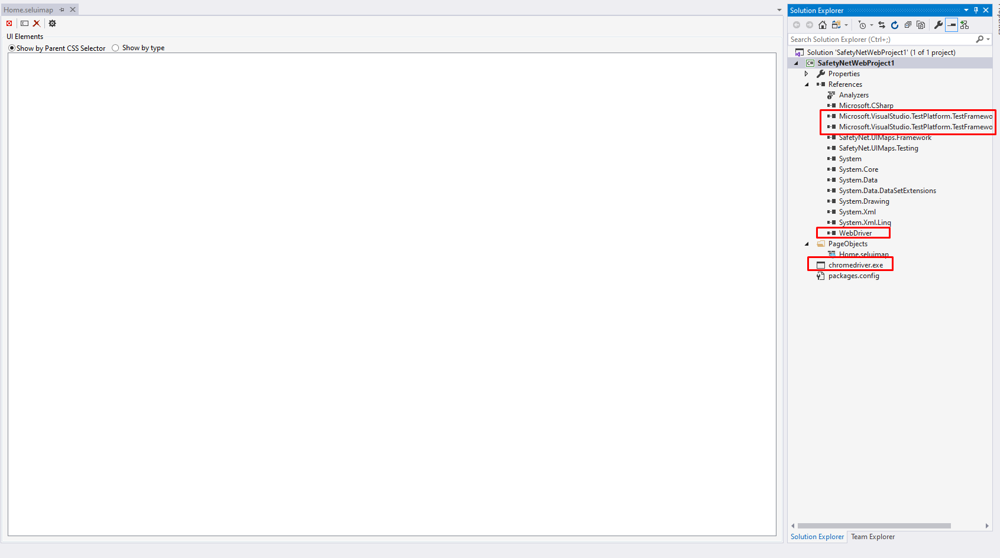

Getting Started
===============

To get started, please install the tool from the Visual Studio Marketplace. At this point only Visual Studio 2017/2019 are supported.

Visual Studio Quick Start Project
---------------------------------

Getting started building tests usually involves a lot of work, finding the Selenium dlls, gathering the web drivers and putting it all into a Visual Studio Project. AS part of this tool we wanted to provide an easy way to get started with one click.
With the tool installation, a new type of Visual Studio Project gets added that will do just that.

1. Start Visual Studio and click "Create new project".
2. Under Visual C# > Test, select Safety Net Web UIMaps project.

.. image:: images/new_project.png
   :align: center

The project will contain all the nuget packages that you need to start testing.
CLick create project and wait for it to be created. The current template include:

* MsTest version 2 assemblies, since this is basically an enhanced unit test project.
* Custom selenium webdriver dll (Is the strong named version of the package)
* Chrome driver
* SafetyNet framework libraries
* A PageObjects folder containing a default seluimap file.

