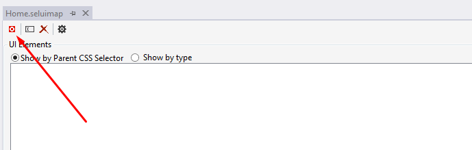

Recording your Web Application
==============================

You can start recording your website in two ways:

* Creating a new UI Map file
* Editing existing ones from Solution Explorer

Creating a new UI Map file
--------------------------

When a new UI Map is created, the extension automatically starts the recording session, you will see the chromedriver command line open up and a Chrome browser to appear.

Editing existing ones from Solution Explorer
--------------------------------------------

There is two ways to add elements to the UI Map after its creation.

- Right click on the UI Map file on the Solution Explorer and click the option Edit UI Map in Browser.

- In the UI Map Editor, click on the Record Elements button to start a new recording.

