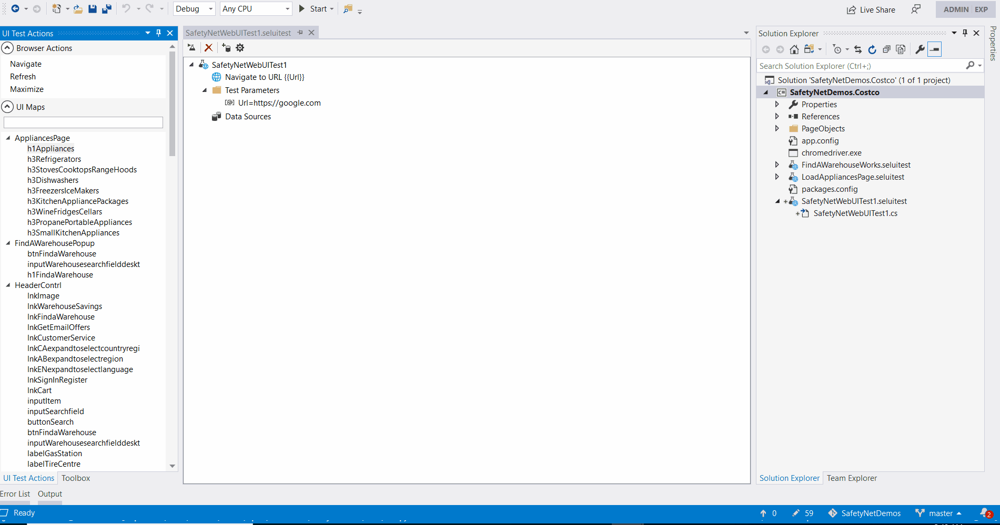

Creating Tests using the UI
===========================

Another way to create tests is using the SafetyNet Web Test items. 
This allows non-devs to collaborate with developers using a drag and drop interface to create test steps.
If there are complex steps or things that the test cannot do yet, devs can create snippets of code that can be reused inside the UI.
All these steps are then translated into a C# Test class that can be run standalone and on a CI/CD pipeline.

When a new SafetyNet Web Test item is created, a Tool Window with all the options and UI Map objects automatically opens.

.. image:: images/create_tests.gif
   :align: center

Creating Test Steps
-------------------

Everytime you drag a control or browser action, a popup shows up with the available actions to do:

- For controls: Click, Hover, Set Value, Validate and Send Keys.
- For browser actions: Maximize, Refresh and Go To Url.

Parameters
----------
You can also have test level parameters that you can use to set values throughout the test.

Data Sources
------------

So far, only CSV files are supported as data sources. More will come in the future.

Reusing Tests
-------------

Partial tests allows the tester to reuse specific set of actions in multiple tests. This allows to have a single place to edit those actions thus increasing maintainability.

Export Test will create a new test file in the project.

.. image:: images/extract_partial_test.gif
   :align: center

Import Test will add the step into the current test.

.. image:: images/import_test.gif
   :align: center

